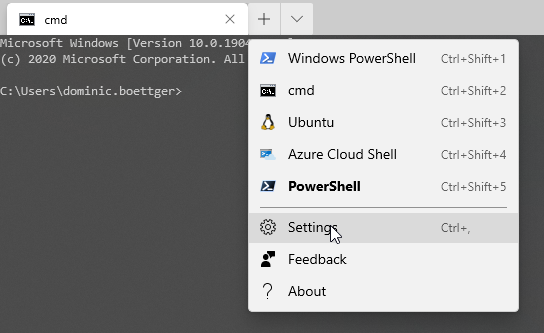

The new Windows Terminal is a big step forward for all people who like to work with the command line. It's available in the [Store](https://www.microsoft.com/store/productId/9N0DX20HK701) or via Chocolatey. I suggest using the Store version to automatically stay up to date.

I did some modifications to the basic Terminal and PowerShell configuration which can eventually be helpful for some people. 

PowerShell modules used by my configuration:

- **posh-git**: Provides status information about a repository and offers tab completion in the terminal.

- **oh-my-posh**: Beautifies the terminal

- **z**: It's a port of the z bash shell script and lets you quickly navigate through your filesystem based on your history. For instance, if you once did a  z ~/development/project and the next time just enter z project you will be guided to the same directory.

## Installation

**Choco - Package manager for windows**:
```powershell
Set-ExecutionPolicy Bypass -Scope Process -Force; [System.Net.ServicePointManager]::SecurityProtocol = [System.Net.ServicePointManager]::SecurityProtocol -bor 3072; iex ((New-Object System.Net.WebClient).DownloadString('https://chocolatey.org/install.ps1'))
```

**PowerShell Core**:
I typically use the core version of PowerShell.
```Powershell
choco install powershell-core
```

**Cascadia Code Font**:
A font supporting Powerline and Ligatures
```powershell
choco install cascadiacodepl
```

Windows Terminal:
I recommend installing the Terminal from the Microsoft Store. https://www.microsoft.com/store/productId/9N0DX20HK701

## Configuration

First, you should configure your Terminal settings and especially set the font to "Cascadia Code PL".

To open the configuration for the Windows Terminal open the Windows Terminal application and click on the "down-arrow" - sign next to the tab bar and click on "Settings". This will open a text editor with the profiles.json.




My Terminal configuration looks like that ( it defaults to PowerShell core )
```JSON
{
    "$schema": "https://aka.ms/terminal-profiles-schema",
    "globals" : 
    {
        "alwaysShowTabs" : true,
        "defaultProfile" : "{574e775e-4f2a-5b96-ac1e-a2962a402336}",
        "initialCols" : 120,
        "initialRows" : 30,
        "keybindings" : 
        [
            {
                "command" : "closeTab",
                "keys" : 
                [
                    "ctrl+w"
                ]
            },
            {
                "command" : "newTab",
                "keys" : 
                [
                    "ctrl+t"
                ]
            },
            {
                "command" : "newTabProfile0",
                "keys" : 
                [
                    "ctrl+shift+1"
                ]
            },
            {
                "command" : "newTabProfile1",
                "keys" : 
                [
                    "ctrl+shift+2"
                ]
            },
            {
                "command" : "newTabProfile2",
                "keys" : 
                [
                    "ctrl+shift+3"
                ]
            },
            {
                "command" : "newTabProfile3",
                "keys" : 
                [
                    "ctrl+shift+4"
                ]
            },
            {
                "command" : "newTabProfile4",
                "keys" : 
                [
                    "ctrl+shift+5"
                ]
            },
            {
                "command" : "newTabProfile5",
                "keys" : 
                [
                    "ctrl+shift+6"
                ]
            },
            {
                "command" : "newTabProfile6",
                "keys" : 
                [
                    "ctrl+shift+7"
                ]
            },
            {
                "command" : "newTabProfile7",
                "keys" : 
                [
                    "ctrl+shift+8"
                ]
            },
            {
                "command" : "newTabProfile8",
                "keys" : 
                [
                    "ctrl+shift+9"
                ]
            },
            {
                "command" : "nextTab",
                "keys" : 
                [
                    "ctrl+tab"
                ]
            },
            {
                "command" : "openSettings",
                "keys" : 
                [
                    "ctrl+,"
                ]
            },
            {
                "command" : "prevTab",
                "keys" : 
                [
                    "ctrl+shift+tab"
                ]
            },
            {
                "command" : "scrollDown",
                "keys" : 
                [
                    "ctrl+shift+down"
                ]
            },
            {
                "command" : "scrollDownPage",
                "keys" : 
                [
                    "ctrl+shift+pgdn"
                ]
            },
            {
                "command" : "scrollUp",
                "keys" : 
                [
                    "ctrl+shift+up"
                ]
            },
            {
                "command" : "scrollUpPage",
                "keys" : 
                [
                    "ctrl+shift+pgup"
                ]
            },
            {
                "command" : "switchToTab0",
                "keys" : 
                [
                    "alt+1"
                ]
            },
            {
                "command" : "switchToTab1",
                "keys" : 
                [
                    "alt+2"
                ]
            },
            {
                "command" : "switchToTab2",
                "keys" : 
                [
                    "alt+3"
                ]
            },
            {
                "command" : "switchToTab3",
                "keys" : 
                [
                    "alt+4"
                ]
            },
            {
                "command" : "switchToTab4",
                "keys" : 
                [
                    "alt+5"
                ]
            },
            {
                "command" : "switchToTab5",
                "keys" : 
                [
                    "alt+6"
                ]
            },
            {
                "command" : "switchToTab6",
                "keys" : 
                [
                    "alt+7"
                ]
            },
            {
                "command" : "switchToTab7",
                "keys" : 
                [
                    "alt+8"
                ]
            },
            {
                "command" : "switchToTab8",
                "keys" : 
                [
                    "alt+9"
                ]
            }
        ],
        "requestedTheme" : "system",
        "showTabsInTitlebar" : true,
        "showTerminalTitleInTitlebar" : true
    },
    "profiles" : 
    [
        {
            "acrylicOpacity" : 0.5,
            "background" : "#012456",
            "closeOnExit" : true,
            "colorScheme" : "Campbell",
            "commandline" : "powershell.exe",
            "cursorColor" : "#FFFFFF",
            "cursorShape" : "bar",
            "fontFace" : "Cascia Code PL",
            "fontSize" : 10,
            "guid" : "{61c54bbd-c2c6-5271-96e7-009a87ff44bf}",
            "historySize" : 9001,
            "icon" : "ms-appx:///ProfileIcons/{61c54bbd-c2c6-5271-96e7-009a87ff44bf}.png",
            "name" : "Windows PowerShell",
            "padding" : "0, 0, 0, 0",
            "snapOnInput" : true,
            "startingDirectory" : "%USERPROFILE%",
            "useAcrylic" : false
        },
        {
            "acrylicOpacity" : 0.75,
            "closeOnExit" : true,
            "colorScheme" : "Campbell",
            "commandline" : "cmd.exe",
            "cursorColor" : "#FFFFFF",
            "cursorShape" : "bar",
            "fontFace" : "Cascia Code PL",
            "fontSize" : 10,
            "guid" : "{0caa0dad-35be-5f56-a8ff-afceeeaa6101}",
            "historySize" : 9001,
            "icon" : "ms-appx:///ProfileIcons/{0caa0dad-35be-5f56-a8ff-afceeeaa6101}.png",
            "name" : "cmd",
            "padding" : "0, 0, 0, 0",
            "snapOnInput" : true,
            "startingDirectory" : "%USERPROFILE%",
            "useAcrylic" : true
        },
        {
            "acrylicOpacity" : 0.5,
            "closeOnExit" : true,
            "colorScheme" : "Campbell",
            "commandline" : "wsl.exe -d Ubuntu",
            "cursorColor" : "#FFFFFF",
            "cursorShape" : "bar",
            "fontFace" : "Cascia Code PL",
            "fontSize" : 10,
            "guid" : "{2c4de342-38b7-51cf-b940-2309a097f518}",
            "historySize" : 9001,
            "icon" : "ms-appx:///ProfileIcons/{9acb9455-ca41-5af7-950f-6bca1bc9722f}.png",
            "name" : "Ubuntu",
            "padding" : "0, 0, 0, 0",
            "snapOnInput" : true,
            "useAcrylic" : false
        },
        {
            "guid": "{b453ae62-4e3d-5e58-b989-0a998ec441b8}",
            "hidden": false,
            "name": "Azure Cloud Shell",
            "source": "Windows.Terminal.Azure"
        },
        {
            "guid": "{574e775e-4f2a-5b96-ac1e-a2962a402336}",
            "hidden": false,
            "name": "PowerShell",
            "source": "Windows.Terminal.PowershellCore",
            "acrylicOpacity" : 0.75,
            "closeOnExit" : true,
            "colorScheme" : "Campbell",
            "cursorColor" : "#FFFFFF",
            "cursorShape" : "bar",
            "fontFace":  "Cascadia Code PL",
            "fontSize" : 10,
            "padding" : "0, 0, 0, 0",
            "snapOnInput" : true,
            "startingDirectory" : "%USERPROFILE%",
            "useAcrylic" : true
        }
    ],
    "schemes" : 
    [
        {
            "name": "Framer",
            "black": "#141414",
            "red": "#ff5555",
            "green": "#98ec65",
            "yellow": "#ffcc33",
            "blue": "#00aaff",
            "purple": "#aa88ff",
            "cyan": "#88ddff",
            "white": "#cccccc",
            "brightBlack": "#414141",
            "brightRed": "#ff8888",
            "brightGreen": "#b6f292",
            "brightYellow": "#ffd966",
            "brightBlue": "#33bbff",
            "brightPurple": "#cebbff",
            "brightCyan": "#bbecff",
            "brightWhite": "#ffffff",
            "background": "#111111",
            "foreground": "#777777"
          },{
            "background" : "#0C0C0C",
            "black" : "#0C0C0C",
            "blue" : "#0037DA",
            "brightBlack" : "#767676",
            "brightBlue" : "#3B78FF",
            "brightCyan" : "#61D6D6",
            "brightGreen" : "#16C60C",
            "brightPurple" : "#B4009E",
            "brightRed" : "#E74856",
            "brightWhite" : "#F2F2F2",
            "brightYellow" : "#F9F1A5",
            "cyan" : "#3A96DD",
            "foreground" : "#CCCCCC",
            "green" : "#13A10E",
            "name" : "Campbell",
            "purple" : "#881798",
            "red" : "#C50F1F",
            "white" : "#CCCCCC",
            "yellow" : "#C19C00"
        },
        {
            "background" : "#282C34",
            "black" : "#282C34",
            "blue" : "#61AFEF",
            "brightBlack" : "#5A6374",
            "brightBlue" : "#61AFEF",
            "brightCyan" : "#56B6C2",
            "brightGreen" : "#98C379",
            "brightPurple" : "#C678DD",
            "brightRed" : "#E06C75",
            "brightWhite" : "#DCDFE4",
            "brightYellow" : "#E5C07B",
            "cyan" : "#56B6C2",
            "foreground" : "#DCDFE4",
            "green" : "#98C379",
            "name" : "One Half Dark",
            "purple" : "#C678DD",
            "red" : "#E06C75",
            "white" : "#DCDFE4",
            "yellow" : "#E5C07B"
        },
        {
            "background" : "#FAFAFA",
            "black" : "#383A42",
            "blue" : "#0184BC",
            "brightBlack" : "#4F525D",
            "brightBlue" : "#61AFEF",
            "brightCyan" : "#56B5C1",
            "brightGreen" : "#98C379",
            "brightPurple" : "#C577DD",
            "brightRed" : "#DF6C75",
            "brightWhite" : "#FFFFFF",
            "brightYellow" : "#E4C07A",
            "cyan" : "#0997B3",
            "foreground" : "#383A42",
            "green" : "#50A14F",
            "name" : "One Half Light",
            "purple" : "#A626A4",
            "red" : "#E45649",
            "white" : "#FAFAFA",
            "yellow" : "#C18301"
        },
        {
            "background" : "#002B36",
            "black" : "#073642",
            "blue" : "#268BD2",
            "brightBlack" : "#002B36",
            "brightBlue" : "#839496",
            "brightCyan" : "#93A1A1",
            "brightGreen" : "#586E75",
            "brightPurple" : "#6C71C4",
            "brightRed" : "#CB4B16",
            "brightWhite" : "#FDF6E3",
            "brightYellow" : "#657B83",
            "cyan" : "#2AA198",
            "foreground" : "#839496",
            "green" : "#859900",
            "name" : "Solarized Dark",
            "purple" : "#D33682",
            "red" : "#DC322F",
            "white" : "#EEE8D5",
            "yellow" : "#B58900"
        },
        {
            "background" : "#FDF6E3",
            "black" : "#073642",
            "blue" : "#268BD2",
            "brightBlack" : "#002B36",
            "brightBlue" : "#839496",
            "brightCyan" : "#93A1A1",
            "brightGreen" : "#586E75",
            "brightPurple" : "#6C71C4",
            "brightRed" : "#CB4B16",
            "brightWhite" : "#FDF6E3",
            "brightYellow" : "#657B83",
            "cyan" : "#2AA198",
            "foreground" : "#657B83",
            "green" : "#859900",
            "name" : "Solarized Light",
            "purple" : "#D33682",
            "red" : "#DC322F",
            "white" : "#EEE8D5",
            "yellow" : "#B58900"
        }
    ]
}
```

The configuration will be automatically refreshed in the Terminal as soon as the file has been saved.

After the Terminal settings have been modified it's time to improve the PowerShell profile.

The profile for the traditional Windows PowerShell can be found here:
C:\Users\YOURUSERNAME\Documents\WindowsPowerShell\Microsoft.PowerShell_profile.ps1

The profile for PowerShell Core can be found here:
C:\Users\YOURUSERNAME\Documents\PowerShell\Microsoft.PowerShell_profile.ps1

Depending on which PowerShell you use ( maybe both ) you can place the content into the files. I typically open the files with VSCode from the PowerShell by typing 
```Powershell
code $profile
```

I added a function to automatically load or install modules depending on their installation state. If a module is missing my system tries to install the missing module from PSGallery.

My PowerShell profile:
```Powershell
function Add-Module ($m) {
  if (Get-Module $m) {
    Write-Output "Module $m is already imported."
  }
  else {
    try {
      Import-Module $m -ErrorAction Stop
    }
    catch {
      Write-Output "Module $m not found locally or error while importing"
      # Find the module online
      if (Find-Module -Name $m | Where-Object { $_.Name -eq $m }) {
        Install-Module -Name $m -Force -Verbose -Scope CurrentUser -AllowClobber
        Import-Module $m -Verbose
      }
      else {
        Write-Output "Module $m not available"
      }
    }
  }
}

function checkFont($font) {
  [System.Reflection.Assembly]::LoadWithPartialName("System.Drawing") | Out-Null
  $families = (New-Object System.Drawing.Text.InstalledFontCollection).Families
  $families -contains $font
}
  
Add-Module "posh-git"
Add-Module "oh-my-posh"
# cd which remembers your history https://www.powershellgallery.com/packages/z/
Add-Module "z"
# Set the posh theme
Set-Theme Paradox
  
# Nice colors for listings
Add-Module "Get-ChildItemColor"
# Set l and ls alias to use the new Get-ChildItemColor cmdlets
Set-Alias l Get-ChildItemColor -Option AllScope
Set-Alias ls Get-ChildItemColorFormatWide -Option AllScope
# Remove the Username from the terminal
$DefaultUser = $env:USERNAME
  
# Setting for git posh
$GitPromptSettings.DefaultPromptAbbreviateHomeDirectory = $true
  
# Chocolatey profile activates tab completion for powershell
$ChocolateyProfile = "$env:ChocolateyInstall\helpers\chocolateyProfile.psm1"
if (Test-Path($ChocolateyProfile)) {
  Import-Module "$ChocolateyProfile"
}
  
# Command to jump to my dev directory
function dev { Set-Location ~/Development }
  
# Java HOME for Android Development ( only if you need it )
$env:JAVA_HOME = "C:\Program Files\Android\Android Studio\jre\"
# Adnroid HOME
$env:ANDROID_HOME = $HOME + "\AppData\Local\Android\Sdk\"
  
# NVM path and path to the android tools
$env:Path = $env:Path + ";" + $env:NVM_HOME + ";" + $env:NVM_SYMLINK + ";" + $env:Android_Home + "\tools;" + $env:Android_Home + "\platform-tools"
# Path to kubectl config
$env:path += $HOME + "\.azure-kubectl"
  
# only enter a single character to use git or kubectl 
Set-Alias -Name g -Value "git" -Description "git"
Set-Alias -Name k -Value "kubectl" -Description "Kubernetes CLI"
```

After modifying the Powershell profile file you should close all open instances of Powershell and the Windows Terminal.

If you open the Terminal and a Powershell Tab the described Powershell Modules should be installed and activated automatically.

## Additional Ressources

A website with some copy-paste configuration for Windows Terminal themes: [https://atomcorp.github.io/themes/](https://atomcorp.github.io/themes/)

