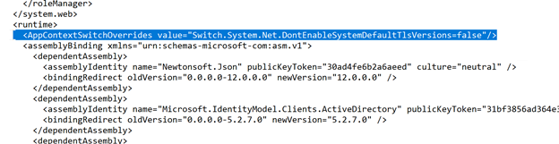
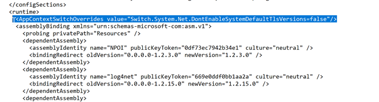

At our company ([INSPIRATIONLABS ](https://inspirationlabs.com)– New Work Technologies) we help our customers get the right infrastructure for their business and to make the lives of their employees better by giving them the right tools for their job. Sometimes it simply starts with the migration from an IMAP server to a cloud solution like Office 365.

Last week we had the problem that we had to migrate from an IMAP server that had TLS older than 1.2 deactivated (which is a good thing 😊). AvePoint Fly was unable to contact the server. I contacted AvePoint support, but they did not know the problem yet. So, I checked out the structure of the AvePoint application and found out that it is based on .NET 4. Then I figured out that when the application is targeted to a .NET version < 4.7 there are problems with TLS 1.2. As I had no access to their codebase, I had to figure out which config in the project needs to be adjusted.

My final workaround for the problem is:

1. C:\Program Files\APElements\FLY\Agent\bin\ImapMigration.exe.config Added the line  `<AppContextSwitchOverrides value="Switch.System.Net.DontEnableSystemDefaultTlsVersions=false"/>`

   
2. C:\Program Files\APElements\FLY\Manager\Control\bin\TimerService.exe.config Added the line: `<AppContextSwitchOverrides value="Switch.System.Net.DontEnableSystemDefaultTlsVersions=false"/>`

   

3. Restartet Fly Agent and Fly Timer Service.

After this we were able to contact the source IMAP server and start the Migration.

References:

[Transport Layer Security (TLS) best practices with the .NET Framework](https://docs.microsoft.com/en-us/dotnet/framework/network-programming/tls)

